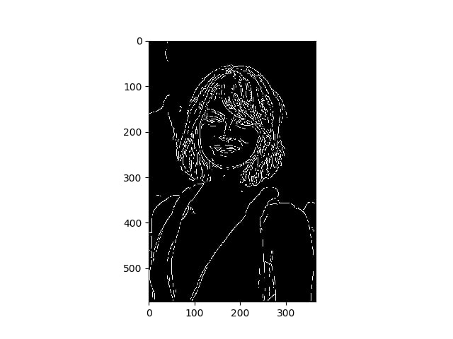
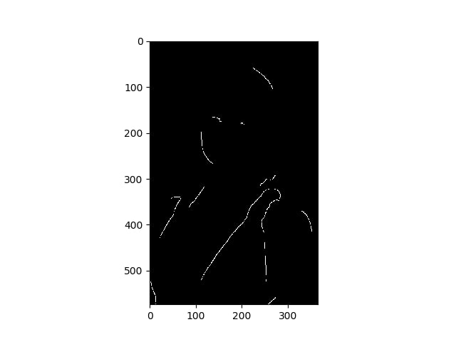
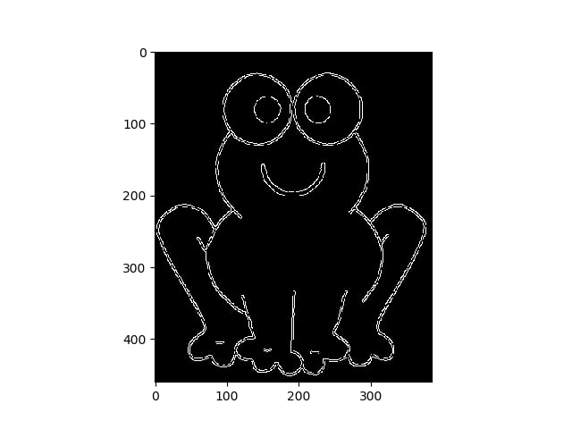
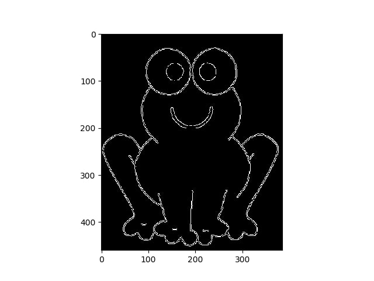
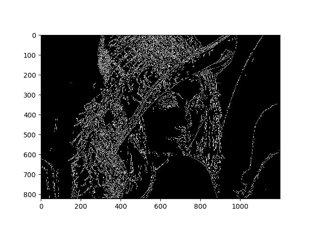
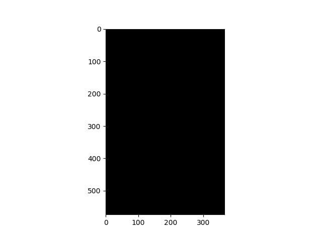
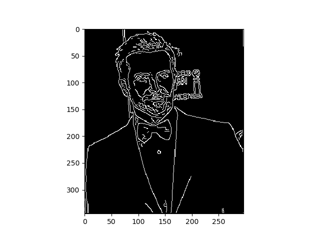
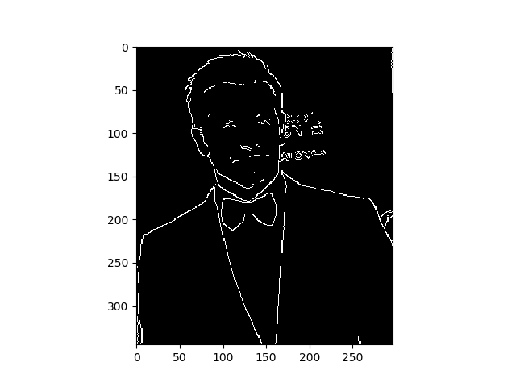

Experment 1.

Experiments description  formulation of hypothesis

Methods used to  perform experiment

Experimental results and graphs to support the results

Conclusion

Vysledky detekcie hran:

### Pôvodný obrázok

### Vlastná implementácia

### Implementácia v OpenCV

### Pôvodný obrázok

### Vlastná implementácia

### Implementácia v OpenCV

### Pôvodný obrázok

### Vlastná implementácia

### Implementácia v OpenCV

### Pôvodný obrázok

### Vlastná implementácia

### Implementácia v OpenCV

