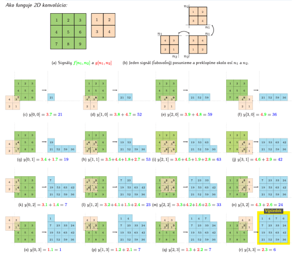
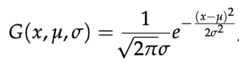
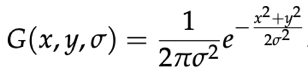

# Candy edge detector

Cannyho hranový detektor je algoritmus na detekciu hrán v obraze, ktorý pozostáva z viacerých algoritmov na detekciu širokého rozsahu hrán v obrazoch. Bol vyvinutý Johnom F. Cannym v roku 1986.

Algoritmus "Canny Edge detector" sa skladá z piatich krokov:
1. **Noise reduction** – Redukcia šumu
2. **Gradient calculation** – Výpočet gradientu
3. **Non-maximu suppression** – Výpočet lokálnych extrémov
4. **Double threshold** – Dvojité prahovanie
5. **Edge Tracking by Hysteresis** – Rozlišovanie hrán pomocou hysterezie

Po vykonaní týchto krokov získame obraz zo zvýraznenými hranami pôvodného obrazu.

## 1. Noise reduction - Redukcia šumu

Pri redukcii šumu budeme aplikovať konvolúciu pri, ktorej prechádzame obrazom a na výpočet novej hodnoty jasu pixelu použijeme jeho rôzne veľké okolie.  Pri tomto postupe využijeme **Gaussov filter** a **Gaussove jadro** (3x3, 5x5, 7x7 atď...). Ako prvé budeme definovať konvolúciu a následne vysvetlíme a zadefinujeme Gassov filter a jeho jadro.

### 1.1 Konvolúcia
Konvolúcia je matematická operácia pri ktorej každá hodnota vo výstupe je určená ako súčet vstupných hodnôt prenásobených koeficientami váh. Jednotlivé koeficienty váh sú definované pomocou Gaussovho jadra. Konvolúcia je definovaná ako

	K(u, v) = (I ⊗ H)(u, v) = ∑ i ∑ j I(u − i, v − j)H(i, j)

kde K(u, v) je hodnota výsledku na pozícii [u, v], symbol ⊗ je operátor konvolúcie, I je vstupný obraz a H je konvolučné jadro.

Konvolúciu sme implementovali ako funkciu, ktorá očakáva na vstupe pôvodný obrázok a Gaussove jadro. Následne prechádza obrázok pixel po pixely a prenásobuje a sčítava jednotlivé hodnoty hodnotami na zadanom indexe v Gaussovej matici až pokiaľ neprejde cez celý obrázok.

### 1.2 Gaussov filter
Medzi lineárne vyhladzovacie filter patrí aj Gaussov filter. Jadro Gaussovho filtra je reprezentované charakteristickým zvonovitým tvarom Gaussovej krivky. Gaussova krivka je v 1D vyjadrená vzťahom

kde σ je štandardnou odchýlkou Gaussovho rozloženia a µ je strednou hodnotou. Parameter σ graf rozširuje a parameter µ posúva graf pozdĺž osi x. Podobne Gaussovo rozloženie v 2D, kde µ = 0, je vyjadrené vzťahom

# Pocitacove Videnie 2019

Toto je Celosemestralna praca

pre spustenie programu pouzite skript "python/python3 celyProgram.py" 
alebo v pripade pouzitia implementacia v openCV "python/python3 celyProgramOpenCV.py"

##Teoreticky popis o algoritme je v PV_Canny_Edge - teoreticky prehlad.docx

##Dokument o pouziti python skriptov na detekciu inych obrazkov ako je defaultne a ina dokumentacia (o vykonanych experimentoch) 
##sa nachadza v dokumente  Dokumentacia.docx

Pri spusteni programu detekcie hran je prednastaveny skript na nacitanie obrazka 'hrany.jpg'

Vyhotovili Kristián Mičko, Roman Haluška a Tomáš Krupa 
