# Candy edge detector

Cannyho hranový detektor je algoritmus na detekciu hrán v obraze, ktorý pozostáva z viacerých algoritmov na detekciu širokého rozsahu hrán v obrazoch. Bol vyvinutý Johnom F. Cannym v roku 1986.

Algoritmus "Canny Edge detector" sa skladá z piatich krokov:
1. **Noise reduction** – Redukcia šumu
2. **Gradient calculation** – Výpočet gradientu
3. **Non-maximu suppression** – Výpočet lokálnych extrémov
4. **Double threshold** – Dvojité prahovanie
5. **Edge Tracking by Hysteresis** – Rozlišovanie hrán pomocou hysterézie

Po vykonaní týchto krokov získame obraz zo zvýraznenými hranami pôvodného obrazu.

## 1. Noise reduction - Redukcia šumu

Pri redukcii šumu budeme aplikovať konvolúciu pri, ktorej prechádzame obrazom a na výpočet novej hodnoty jasu pixelu použijeme jeho rôzne veľké okolie.  Pri tomto postupe využijeme **Gaussov filter** a **Gaussove jadro** (3x3, 5x5, 7x7 atď...). Ako prvé budeme definovať konvolúciu a následne vysvetlíme a zadefinujeme Gassov filter a jeho jadro.

### 1.1 Konvolúcia
Konvolúcia je matematická operácia pri ktorej každá hodnota vo výstupe je určená ako súčet vstupných hodnôt prenásobených koeficientami váh. Jednotlivé koeficienty váh sú definované pomocou Gaussovho jadra. Konvolúcia je definovaná ako

	K(u, v) = (I ⊗ H)(u, v) = ∑ i ∑ j I(u − i, v − j)H(i, j)

kde K(u, v) je hodnota výsledku na pozícii [u, v], symbol ⊗ je operátor konvolúcie, I je vstupný obraz a H je konvolučné jadro.

Konvolúciu sme implementovali ako funkciu, ktorá očakáva na vstupe pôvodný obrázok a Gaussove jadro. Následne prechádza obrázok pixel po pixely a prenásobuje a sčítava jednotlivé hodnoty hodnotami na zadanom indexe v Gaussovej matici až pokiaľ neprejde cez celý obrázok.

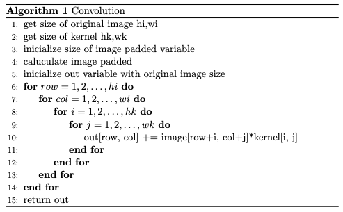

### 1.2 Gaussov filter
Medzi lineárne vyhladzovacie filter patrí aj Gaussov filter. Jadro Gaussovho filtra je reprezentované charakteristickým zvonovitým tvarom Gaussovej krivky. Gaussova krivka je v 1D vyjadrená vzťahom

kde σ je štandardnou odchýlkou Gaussovho rozloženia a µ je strednou hodnotou. Parameter σ graf rozširuje a parameter µ posúva graf pozdĺž osi x. Podobne Gaussovo rozloženie v 2D, kde µ = 0, je vyjadrené vzťahom

Úlohou Gaussovho filtra je hlavne odstránenie šumu a rozmazanie obrazu. Sigma určuje stupeň rozmazania obrazu. Vyššie hodnoty parametru sigma vyžadujú vytvorenie väčšieho jadra, aby bolo reprezentované dostatočne presne. Spravidla veľkosť jadra je určená ako (2K + 1) X (2K + 1), kde K = d3σe. Výstupom Gaussovho filtra je vážený priemer okolia každého pixelu, pričom váhy sú vyššie smerom k stredovým pixelom jadra. Vďaka tejto vlastnosti Gaussov filter poskytuje jemnejšie rozmazanie a zachováva hrany.

Pri implementácii gaussovho jadra sme zadefinovali funkciu “gaussian_kernel”, ktorá na vstupe očakáva veľkosť matice a sigmu, ktorá je defaultne nastavená na hodnotu 1. Pre výpočet gassovej maticke sme použili vyššie vyjadrený vzťah o Gaussovom rozložení v 2D.

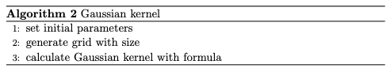

## 2. Gradient calculation – výpočet gradientu
Krok výpočtu gradientu zisťuje intenzitu a smer hrany vypočítaním gradientu obrázka pomocou operátorov detekcie okrajov. Hrany zodpovedajú zmene intenzity pixelov. Najjednoduchším spôsobom na detekciu je použitie filtrov, ktoré zvýrazňujú túto zmenu intenzity v oboch smeroch a to horizontálne na osi x aj vertikálne na osi y.

### 2.1 Sobel operator or filter
Keď je obraz vyhladený môžeme implementovať konvolúciou s jadrom Sobel Kx a Ky. Sobel operátor alebo filter využíva dve matice Gx pre x os a Gy pre y os o rozmere 3x3 ako konvolucne jadro pri konvolúcii pôvodného orázku.

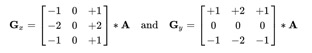

Súradnica x je tu definovaná ako zvyšujúca sa v smere „doprava“ a súradnica y je definovaná ako zvyšujúca sa v smere „dole“. V každom bode na obrázku sa výsledné aproximácie gradientu môžu kombinovať, aby sa získala veľkosť gradientu, s použitím vzorca

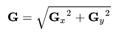

Ďalej môžeme vypočítať aj smer gradientu na to použijeme vzorec

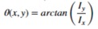

Pri implementácii sme vytvorili konvolučné jadro pre x a y os. Následne sme aplikovali konvolúciu na pôvodný obrázok s vytvoreným konvolučným jadrom pre obe osi zvlášť. Následne sme aplikovali vyššie uvedené vzorce na výpočet veľkosti a smeru gradientu.

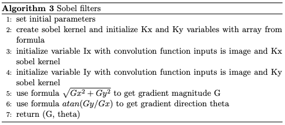

## 3. Non-Maximum Suppression - výpočet lokálnych extrémov
Po predchádzajúcich krokoch možete v obrázku vidieť, že niektoré hrany sú tenké, iné zase hrubé.  Metódou non- maximum suppression dosiahneme potlačenie hrubých hrán.

Algoritmus prechádza všetkými bodmi matice gradientu a hľadá pixely, s maximálnou hodnotou v smeroch hrán.

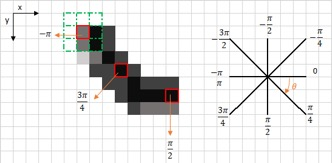

Na obrázku vyššie sú zobrazené červené štvorce na pixeloch jasu matice gradientu a oranžové šípky pre smer hrany s príslušným uhlom v radiánoch. V pravej časti obrázku je jednotková kružnica so smermi, kam môže hrana smerovať a uhly v radiánoch k jednotlivým smerom.

Cieľom algoritmu je zistiť, či pixely v rovnakom smere, majú väčší alebo menší jas ako pôvodný pixel.  Ak má nejaký pixel jas väčší, tak uchová sa iba jeho hodnota a pôvodný pixel sa nastaví na 0.

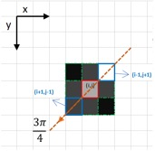

Tento obrázok demonštruje výber pixelu s vyšším jasom v smere hrany. Pixel v strede (i,j) považujme za ten pôvodný, oranžová šipka naznačuje smer šírenia hrany a pixely v modrom štvorci sú tie, ktoré idú v smere šípky. Jasnejší ako pôvodný pixel je ten v pravom hornom rohu. Z toho vyplýva, že najjasnejší pixel v smere hrany je pixel (i-1, j+1) pod uhlom 3.pi/4.

Postup pre metódu Non-Maximum Suppression je teda nasledovný:

1. Vytvoriť a inicializovať maticu rovnako veľkú ako pôvodná gradientová jasová matica.
2. Identifikovať smer hrany na základe uhla
3. Zistiť, či ma nejaký pixel v rovnakom smere vyšší jas ako pôvodný pixel
4. Na výstupe je spracovaný celkový obraz po prejdení algoritmu cez všetky pixely

Výsledkom algoritmu je obrázok s tenšími hranami

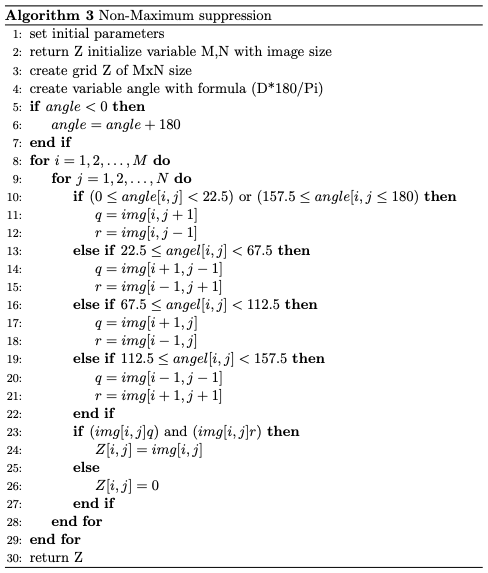

Po spracovaní obrazu predchádzajúcimi krokmi je potrebné nastaviť finálny obraz do binárnej podoby tak, že ohraničené hrany budú mať bielu farbu a ostatné pixely mimo hrán budú mať čiernu farbu.  Na to slúžia tieto 2 metódy: dvojité prahovanie a hysterezne rozlíšenie hrán.

## 4. Double threshold - Dvojité prahovanie
V tomto kroku sa zameriavame na prehľadávanie pixelov v obraze a zatrieďujeme ich do niekoľkých kategórii podľa prahov. Rozlišujeme dva prahy dolný prah a horný prah. Horný prah sa používa na identifikáciu pixelov, ktoré budú určite zaradené do detekcie hran vo finálnom binárnom obraze a naopak dolný prah slúži na identifikáciu pixelov, ktoré na detekciu hrán budú vylúčené. Poznáme tieto pixely:

1. Silné – jas pixelu presahuje horný prah
2. Slabé – jas pixelu nepresahuje horný prah, ale je vyššie ako dolný prah (spracujú sa v ďalšej fáze)
3. Nerelevantné – jas pixelu je nižší ako dolný prah

Nastavenie prahov nemá jasné definovanie, ale by mal by byť zachovaný pomer, že dolný prah má mať hodnotu horného prahu. V našom prípade to bolo tak, že dolný prah mal hodnotu 0.05 v argumente a horný prah hodnotu 0.09 v argumente.

## 5. Edge Tracking by Hysteresis - Rozlišovanie hrán pomocou hysterézie
V predchádzajúcej podkapitole sme sa venovali ako roztriediť pixely do kategórii a podľa toho sme sa rozhodovali, či vylúčiť alebo si ponechať jednotlivé pixely na detekciu hrán. Ostali nám finálnu analýzu pixely, ktoré sú slabé z hľadiska prahovania. V tomto kroku sa budeme zaoberať ako ich využiť vo finálnom binárnom obraze.

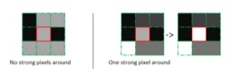

<![endif]-->

Postup je v tejto fáze jednoduchý a pekne znázornený na obr. vyššie. Jednoducho si vezme ako pri konvolúcii určité okolie napr. 3x3 a prechádzame každý pixel v obrázku a porovnávame stred sledovaného pixelu s okolitými pixelmi. Ak sa v okolí dotyčného pixelu nachádza aspoň jeden silný pixel, tak sledovanému slabý pixel zaradíme k hrane (priradíme mu max hodnotu). Ak táto podmienka nie je splnená tak slabý pixel vylúčime k priradeniu hrán.

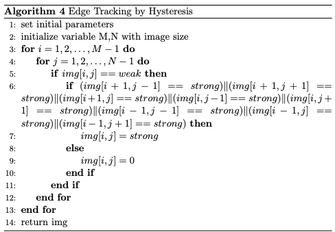

## 6. Využitie algoritmu v praxi
Tento algoritmus sa využíva na rozlíšenie objektov pri skúmaní snímok z medicíny, záberov z družice Zeme, prieskumných lietadiel, pri trénovaní rôznych neurónových sieti. Hlavným významom detekcie hrán je vyhľadať miesta zo značne výraznými hodnotami jasu. Tieto miesta môžeme nazývať ako hraničné miesta objektov. Metódy detekcie hrán takéto miesta vyhľadávajú a pomocou rôznych matematických metód sa snažia aproximovať krivky jednotlivých skúmaných objektov. Pri veľkej kvalite obrázku je spracovanie informácii výpočtovo náročné a preto sa navrhli rôzne algoritmy pre extrakciu hrán z obrazu, aby boli zachované dôležité informácie v obraze a zároveň, aby sa optimalizovala rýchlosť výpočtu spracovania informácii. Vďaka tomu môžeme digitálne vyhodnocovať informácie z obrazov a tak dosiahnuť vyššiu automatizáciu činnosti v bežnom živote.

### Použitá literatúra
1. [https://towardsdatascience.com/canny-edge-detection-step-by-step-in-python-computer-vision-b49c3a2d8123](https://towardsdatascience.com/canny-edge-detection-step-by-step-in-python-computer-vision-b49c3a2d8123)

2. [https://cs.wikipedia.org/wiki/Konvoluce](https://cs.wikipedia.org/wiki/Konvoluce)

3. [https://core.ac.uk/download/pdf/44392459.pdf](https://core.ac.uk/download/pdf/44392459.pdf)

4. [https://opencv-python-tutroals.readthedocs.io/en/latest/py_tutorials/py_imgproc/py_canny/py_canny.html](https://opencv-python-tutroals.readthedocs.io/en/latest/py_tutorials/py_imgproc/py_canny/py_canny.html)

5. [https://github.com/FienSoP/canny_edge_detector/blob/master/utils/utils.py](https://github.com/FienSoP/canny_edge_detector/blob/master/utils/utils.py)

6. [http://www.posterus.sk/?p=11234](http://www.posterus.sk/?p=11234)

7. [https://stackoverflow.com/questions/52140247/naive-implementation-of-convolution-algorithm/52141580](https://stackoverflow.com/questions/52140247/naive-implementation-of-convolution-algorithm/52141580)

# Pocitacove Videnie 2019

Toto je Celosemestralna praca

pre spustenie programu pouzite skript "python/python3 celyProgram.py" 
alebo v pripade pouzitia implementacia v openCV "python/python3 celyProgramOpenCV.py"

##Teoreticky popis o algoritme je v PV_Canny_Edge - teoreticky prehlad.docx

##Dokument o pouziti python skriptov na detekciu inych obrazkov ako je defaultne a ina dokumentacia (o vykonanych experimentoch) 
##sa nachadza v dokumente  Dokumentacia.docx

Pri spusteni programu detekcie hran je prednastaveny skript na nacitanie obrazka 'hrany.jpg'

Vyhotovili Kristián Mičko, Roman Haluška a Tomáš Krupa 
